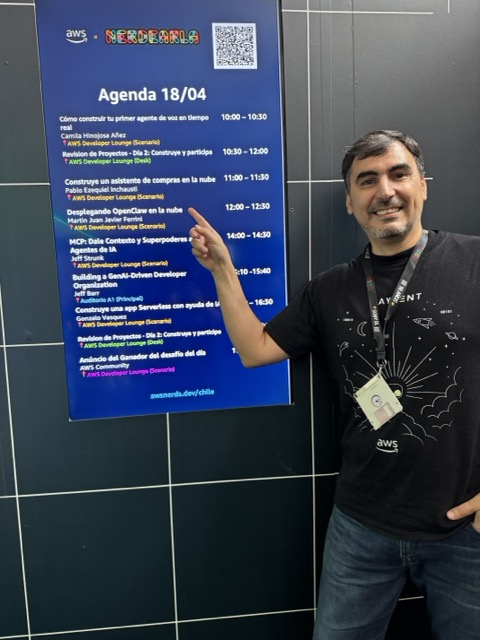
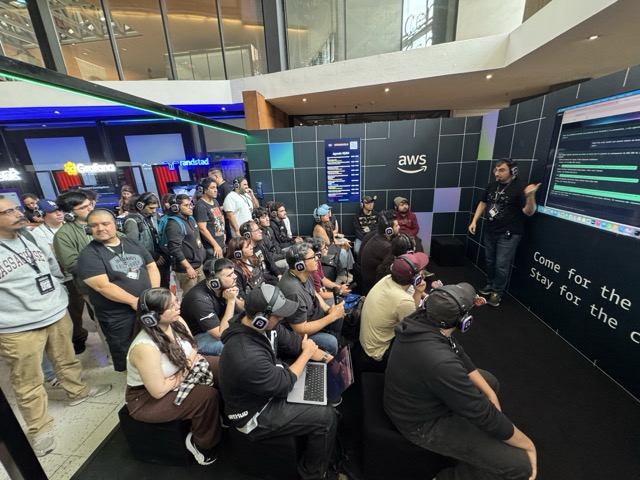
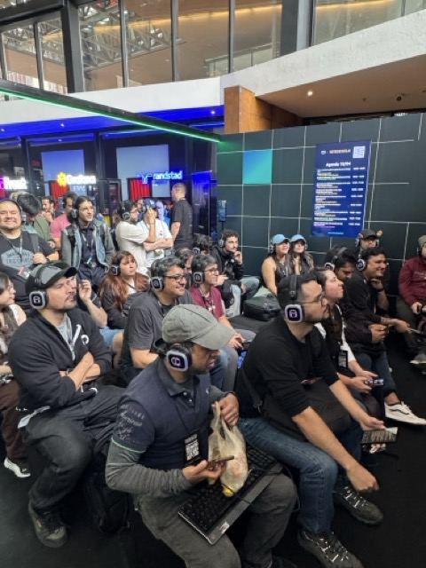
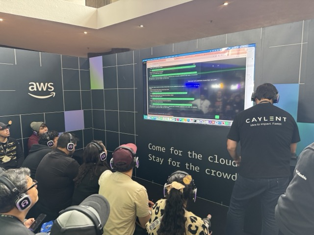
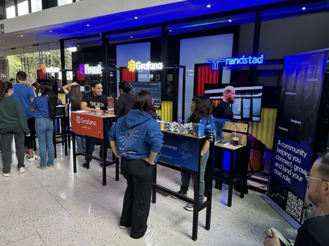
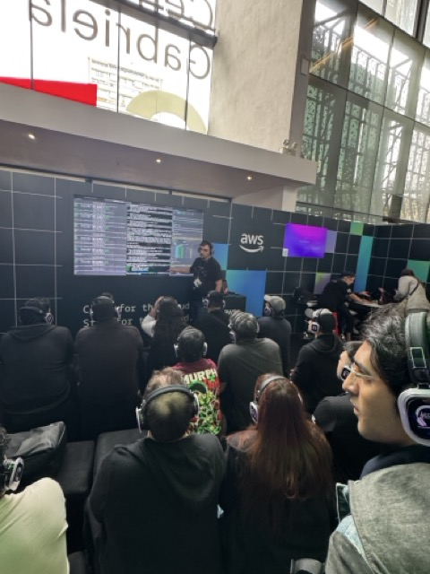
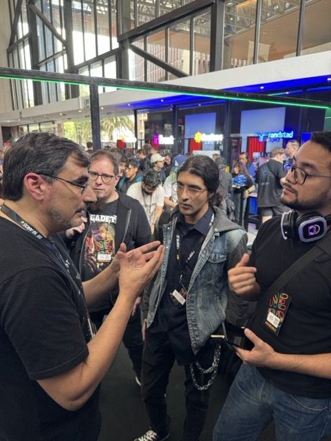
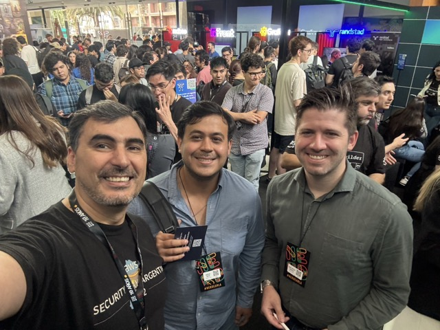
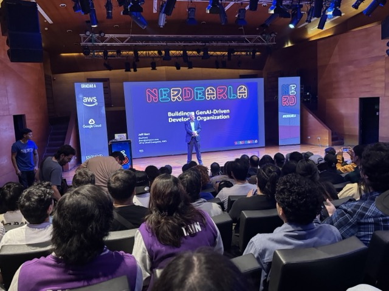

# Nerdearla Chile 2026 - AWS Booth

This repository documents the AWS presence at Nerdearla Chile 2026 and the booth session around building AI agents with AWS.

The talk, **AWS AgentCore + MCP**, presented a practical look at how generative AI applications can move beyond simple prompts and into tool-using, observable, multi-agent systems. The demo used **ShopMind**, an AI shopping assistant, to show agents collaborating across product search, price comparison, review analysis, and budget validation.

## Event

Nerdearla brings together developers, technologists, builders, and community leaders across Latin America. The Chile 2026 edition created a space to share practical engineering work, emerging cloud patterns, and hands-on demos with the local tech community.

At the AWS booth, attendees could see how AWS services can support real-world AI applications, from agent orchestration to serverless deployment and observability.

## AWS Booth Session

The session focused on a live demo of an AI assistant built with:

- **Amazon Bedrock AgentCore** for agent orchestration
- **Model Context Protocol (MCP)** for connecting agents to external tools
- **AWS Lambda** for serverless tool execution
- **CloudWatch** for tracing and observability
- **Kiro** for AI-assisted development

The goal was to make the architecture tangible: attendees could see multiple specialized agents working together, each responsible for a different part of the shopping workflow.

## Talk Theme

The core idea behind the talk was simple:

> Useful AI products need more than a model response. They need tools, context, orchestration, and visibility.

ShopMind was used as the demo scenario because shopping assistants are easy to understand, but still require real coordination between search, prices, reviews, constraints, and final recommendations.

## Photo Gallery

Photos from the event and AWS booth are stored in [`aws-nerdearla/`](aws-nerdearla/).

## Materials

- Slides: [`ppt/AWS AgentCore + MCP - Nerdearla Chile 2026.html`](<ppt/AWS AgentCore + MCP — Nerdearla Chile 2026.html>)
- Demo project: [`ShopMind-app/`](ShopMind-app/)
- Booth photos: [`aws-nerdearla/`](aws-nerdearla/)

## Credits

Created for the AWS booth at Nerdearla Chile 2026, as part of a session on agentic applications, MCP, and practical generative AI patterns on AWS.
